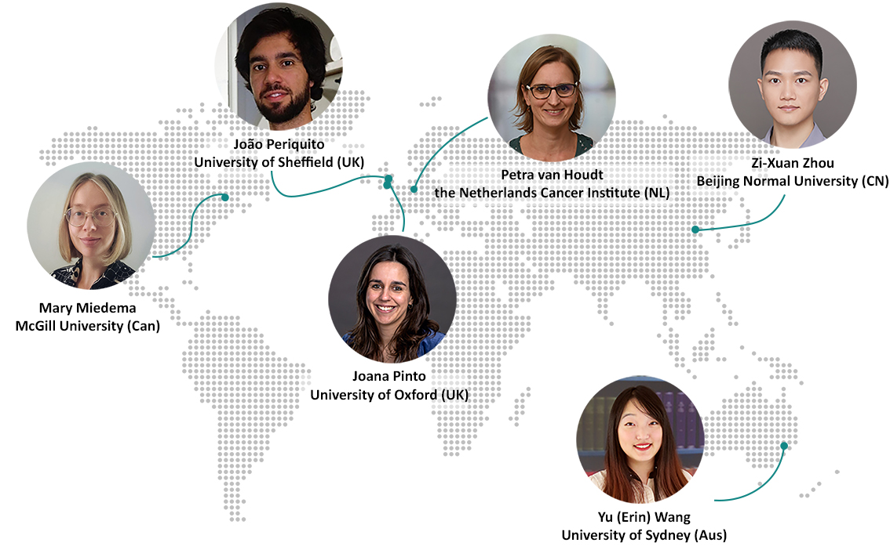

--- 
title: Organizing Committee
layout: default
description: Workshop's organizing committee
year: 2023
--- 

<!-- Image Map Generated by http://www.image-map.net/ -->

<map name="image-map">
    <area target="_blank" alt="Joao Periquito" title="Joao Periquito" href="https://www.linkedin.com/in/joao-periquito/" coords="239,1,467,218" shape="rect">
    <area target="_blank" alt="Mary Miedema" title="Mary Miedema" href="https://www.linkedin.com/in/marymiedema/" coords="213,436,13,203" shape="rect">
    <area target="_blank" alt="Joana Pinto" title="Joana Pinto" href="https://www.linkedin.com/in/joanacspinto/" coords="609,517,388,286" shape="rect">
    <area target="_blank" alt="Petra van Houdt" title="Petra van Houdt" href="https://www.linkedin.com/in/petra-van-houdt-a7612510/" coords="860,265,550,15" shape="rect">
    <area target="_blank" alt="Zi-Xuan Zhou" title="Zi-Xuan Zhou" href="https://orcid.org/0000-0002-9894-7934" coords="1131,261,881,15" shape="rect">
    <area target="_blank" alt="Erin Wang" title="Erin Wang" href="https://www.linkedin.com/in/erin-yufeng-wang/" coords="713,463,936,702" shape="rect">
</map>

<!--this is a copy to trick the style issue that this is a figure. This block needs to be replaced once the figure is ready-->
<!--

<table style="width:100%">
<tbody>
<tr>
    <td></td>
    <td><strong><a href="https://www.linkedin.com/in/joanacspinto/">Joana Pinto <a style="font-size: smaller;">(she/her; co-chair)</a></a></strong>  University of Oxford, UK</td>
</tr>
<tr>
<td></td>
<td><strong><a href="https://www.linkedin.com/in/petra-van-houdt-a7612510/">Petra van Houdt <a style="font-size: smaller;">(she/her; co-chair)</a></a></strong>  the Netherlands Cancer Institute, the Netherlands</td>
</tr>
<tr>
    <td></td>
    <td><strong><a href="https://www.linkedin.com/in/joao-periquito/">Jo&#227;o Periquito <a style="font-size: smaller;">(he/him)</a></a></strong>  University of Sheffield, UK</td>
</tr>
<tr>
    <td></td>
    <td><strong><a href="https://www.linkedin.com/in/marymiedema/">Mary Miedema <a style="font-size: smaller;">(she/her)</a></a></strong>  McGill University, Canada</td>
</tr>
<tr>
    <td></td>
    <td><strong><a href="https://www.linkedin.com/in/erin-yufeng-wang/">Yu (Erin) Wang <a style="font-size: smaller;">(she/her)</a></a></strong>  University of Sydney, Australia</td>
</tr>
<tr>
    <td></td>
    <td><strong><a href="https://orcid.org/0000-0002-9894-7934">Zi-Xuan Zhang <a style="font-size: smaller;">(he/him)</a></a></strong>  Beijing Normal University, China</td>

</tr>
</tbody>
</table>

 -->

<table style="width:100%">
<tbody>
<tr>
    <td></td>
    <td><strong><a href="https://www.linkedin.com/in/joanacspinto/">Joana Pinto <a style="font-size: smaller;">(she/her; co-chair)</a></a></strong>  University of Oxford, UK</td>
</tr>
<tr>
<td></td>
<td><strong><a href="https://www.linkedin.com/in/petra-van-houdt-a7612510/">Petra van Houdt <a style="font-size: smaller;">(she/her; co-chair)</a></a></strong>  the Netherlands Cancer Institute, the Netherlands</td>
</tr>
<tr>
    <td></td>
    <td><strong><a href="https://www.linkedin.com/in/joao-periquito/">Jo&#227;o Periquito <a style="font-size: smaller;">(he/him)</a></a></strong>  University of Sheffield, UK</td>
</tr>
<tr>
    <td></td>
    <td><strong><a href="https://www.linkedin.com/in/marymiedema/">Mary Miedema <a style="font-size: smaller;">(she/her)</a></a></strong>  McGill University, Canada</td>
</tr>
<tr>
    <td></td>
    <td><strong><a href="https://www.linkedin.com/in/erin-yufeng-wang/">Yu (Erin) Wang <a style="font-size: smaller;">(she/her)</a></a></strong>  University of Sydney, Australia</td>
</tr>
<tr>
    <td></td>
    <td><strong><a href="https://orcid.org/0000-0002-9894-7934">Zi-Xuan Zhang <a style="font-size: smaller;">(he/him)</a></a></strong>  Beijing Normal University, China</td>

</tr>
</tbody>
</table>

   
 The program committee greatly appreciates the guidance and assistance of the <a href="https://www.esmrmb.org/working-groups/">MRI Together Working Group of ESMRMB</a>.

