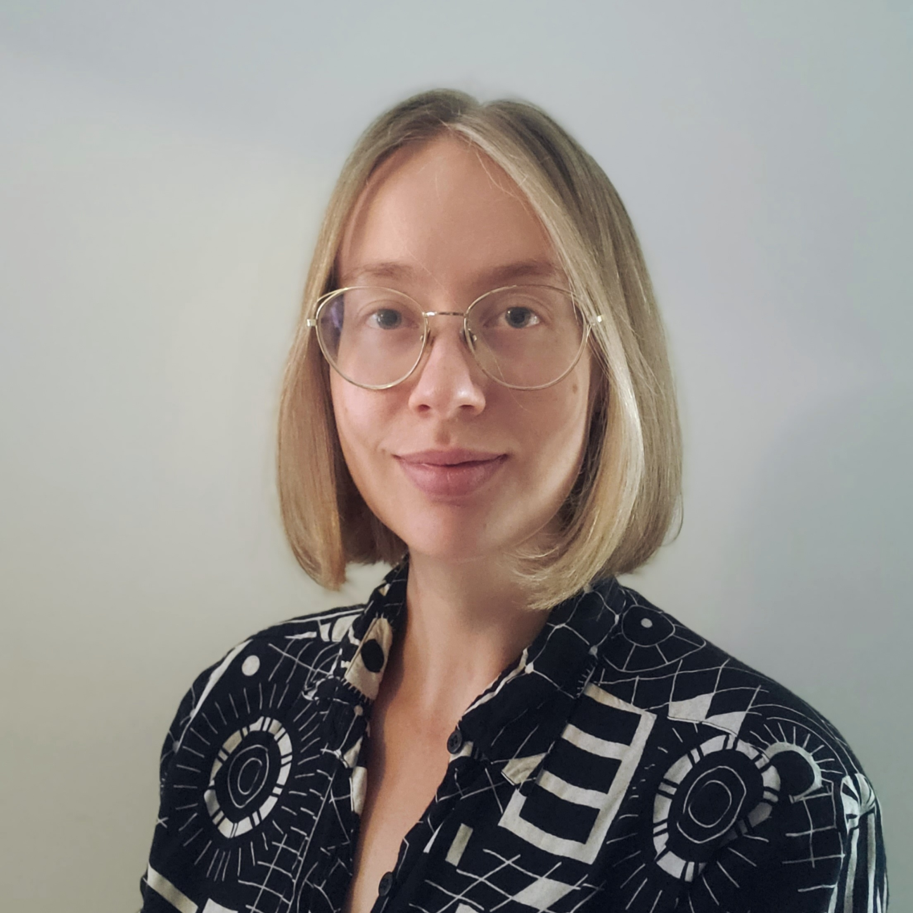
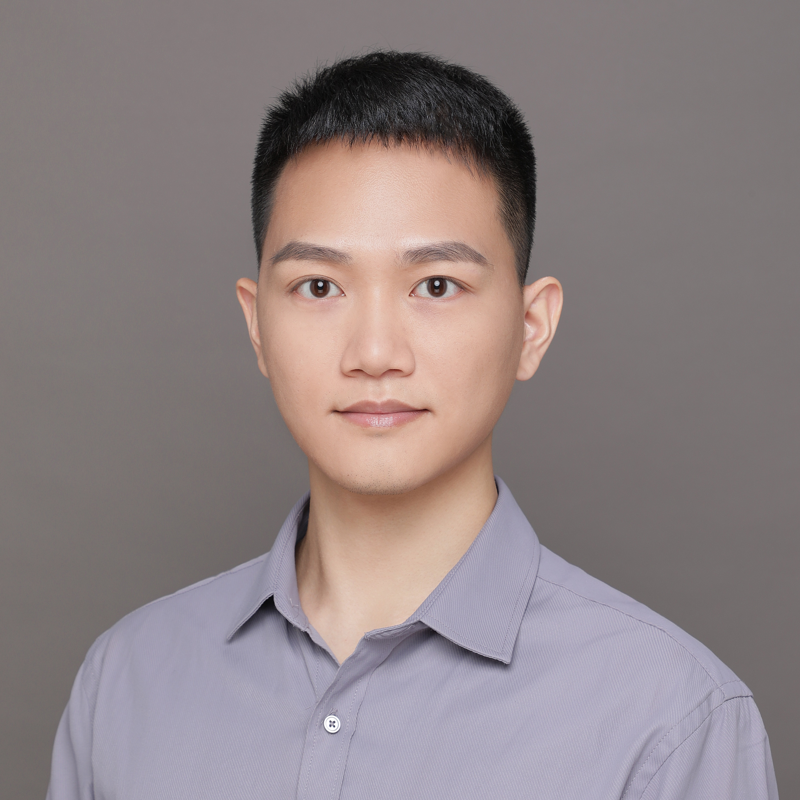

--- 
title: Organizing Committee
layout: default
description: Workshop's organizing committee
year: 2023
--- 

<table style="width:100%">
<tbody>
<tr>
    <td></td>
    <td><strong><a href="https://www.linkedin.com/in/joanacspinto/">Joana Pinto <a style="font-size: smaller;">(she/her; co-chair)</a></a></strong>  University of Oxford, UK</td>
</tr>
<tr>
<td></td>
<td><strong><a href="https://www.linkedin.com/in/petra-van-houdt-a7612510/">Petra van Houdt <a style="font-size: smaller;">(she/her; co-chair)</a></a></strong>  the Netherlands Cancer Institute, the Netherlands</td>
</tr>
<tr>
    <td></td>
    <td><strong><a href="https://www.linkedin.com/in/joao-periquito/">Jo&#227o Periquito <a style="font-size: smaller;">(he/him)</a></a></strong>  University of Sheffield, UK</td>
</tr>
<tr>
    <td></td>
    <td><strong><a href="https://www.linkedin.com/in/marymiedema/">Mary Miedema <a style="font-size: smaller;">(she/her)</a></a></strong>  McGill University, Canada</td>
</tr>
<tr>
    <td></td>
    <td><strong><a href="https://www.linkedin.com/in/erin-yufeng-wang/">Yu (Erin) Wang <a style="font-size: smaller;">(she/her)</a></a></strong>  University of Sydney, Australia</td>
</tr>
<tr>
    <td></td>
    <td><strong><a href="https://orcid.org/0000-0002-9894-7934">Zi-Xuan Zhang <a style="font-size: smaller;">(he/him)</a></a></strong>  Beijing Normal University, China</td>

</tr>
</tbody>
</table>

   
 The program committee greatly appreciates the guidance and assistance of the The MRI Together Working Group of ESMRMB:
<ul>
 <li> Fransesco Santini- <a href="https://www.francescosantini.com/wp/" style="text-decoration: underline;">University Hospital of Basel</a></li>
 <li> Laura Bell- <a href="https://www.linkedin.com/in/lauracbell/" style="text-decoration: underline;">Genentech</a> </li>
 <li> Sophie Schaumann- <a href="https://sophieschau.github.io/" style="text-decoration: underline;">Stanford University</a> </li>
 <li> Mo Shadloo- <a href="https://moshahdloo.com/" style="text-decoration: underline;">Vicon</a> </li>
</ul> 

