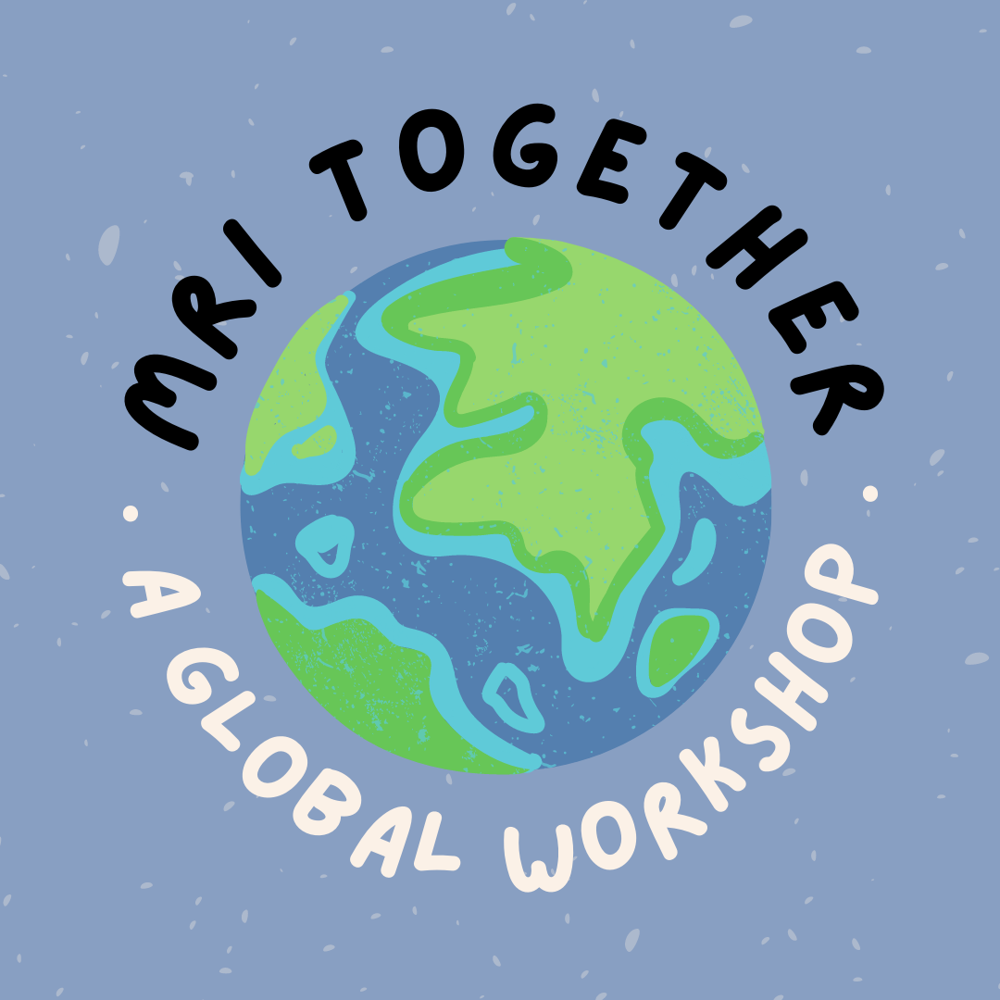

## What?

{: style="float: left; margin-right: 2em;"}

What's all the buzz about **open science**, **reproducibility**, and **inclusivity**?

[**#MRITogether**](https://twitter.com/hashtag/MRITogether) is a global online event on open, reproducible, and inclusive MRI research. 
The meeting hosts lectures, panel discussions, and hands-on workshops by prominent speakers from industry and academia. 
Topics ranging from statistical tools for reproducible research, to open hardware and software practices, to data sharing policies, and the obstacles and best practices in using artificial intelligence in MRI will be covered.

Topics will include, but not be limited to:

* Open source tools for acquisition, reconstruction and analysis
* Inclusive Science
* Data sharing
* Perspective on open science outside academia
* Green Science

## When?
The workshop will be held on **December 6 to 8, 2023 (UTC)**. We will have [sessions in all time zones](23m/schedule), and all the talks will be recorded and available for immediate offline use. 
No matter where you are in the world, you will have exciting live sessions during your daytime, and lots of contents to watch at your convenience.
We will also have networking activities and a social platform to gather, discuss, and meet our [sponsors](23m/sponsors).

## Who?
We are a [team](23m/committee) of MRI scientists from different corners of the MRI world (as well as the physical world) with a passion for open, reproducible and inclusive science. 
With support and endorsement from [ESMRMB](https://esmrmb.org/) this global workshop aims to bring MRI enthusiasts together.
Whether you're a **MR scientist**, **scientific software developer**, **medical doctor**, **researcher in basic science**, or **data scientist**, there's something for you here. 
If you are passionate about Open Science, join us!

