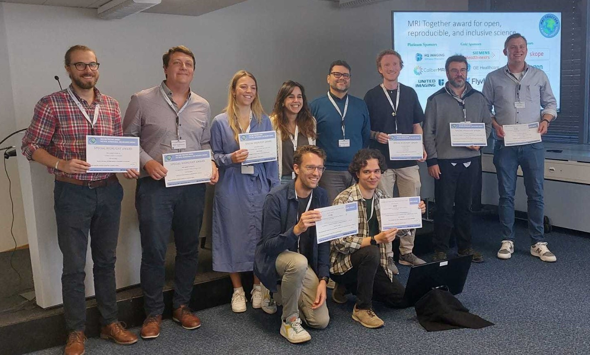

### MRI Together activities at ESMRMB 2023
MRI Together was actively involved in this year’s ESMRMB annual meeting. 
The newly-formed Working Group and the 2023 committee and event were introduced in a 60-minute session on the 7th of October, in Basel, Switzerland. 
The organisers of this session were Francesco Santini (co-chair of the 2021 MRI Together, representing the working group) and Joana Pinto (co-chair of the 2023 MRI Together). 
This session had approximately 40 attendees.
Francesco briefly presented some data about the first two editions of MRI together, which grew from approximately 700 (in the first edition) to more than 1000 (in the second edition) registered attendees, and talked about how the working group will support the Program Committee with practical matters such as sponsoring, the management of the digital platforms used for the workshop, and the selection of future committees.
Joana presented the current program committee and the program overview of the 2023 edition of MRI Together.

Additionally, during this session, authors of nine pre-selected ESMRMB abstracts related to open-science, reproducibility and inclusivity were given the opportunity to do a short presentation on their work. All presenters received a certificate and three abstracts were awarded the MRI Together Award for Open, Reproducible, and Inclusive Science:

***1st prize***: “How to establish and maintain a multimodal animal MRI dataset using DataLad” by Aref Kalantari Sarcheshmeh (Cologne Medical University, Germany) and colleagues.

***2nd prize***: “Vendor-agnostic pulse programming on gammaSTAR: A traveling head experiment to test the Philips driver” by Martijn Nagtegaal (Leiden University Medical Center, the Netherlands) and collaborators.

***3rd prize***: ”Harmonization of clinical neuro protocols on multiple systems” by Pim Pullens (Ghent University, Belgium) and colleagues.

{: style="float: left; width: 100%; height: 100%"}
