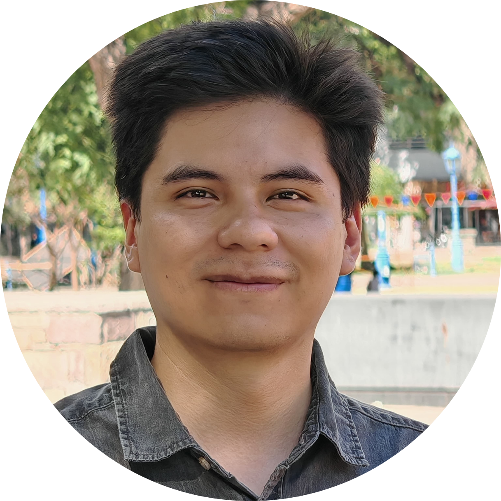
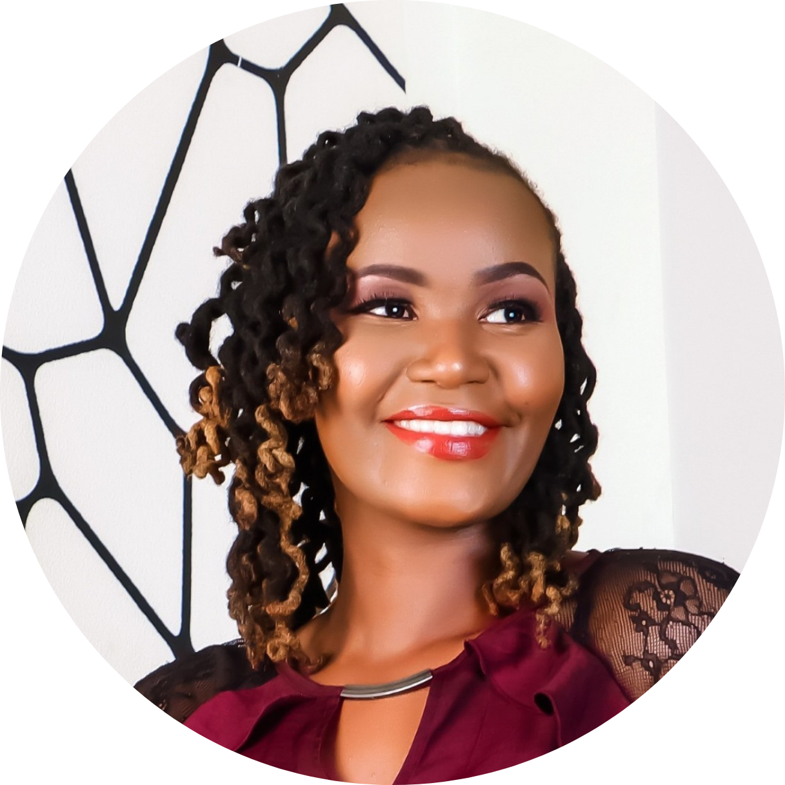
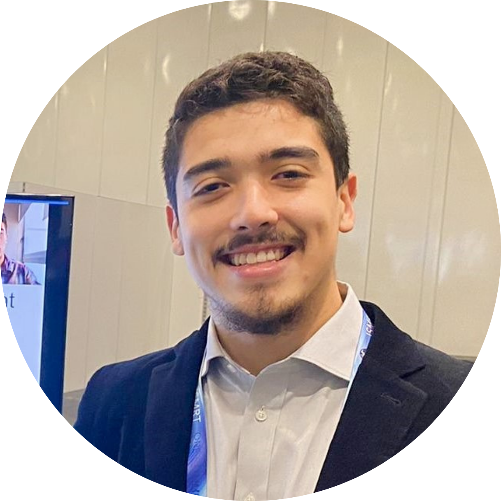
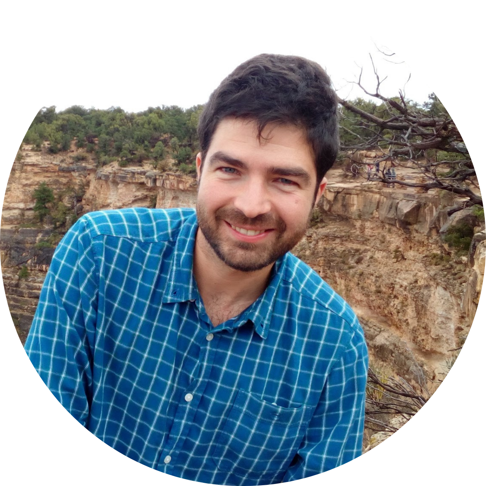
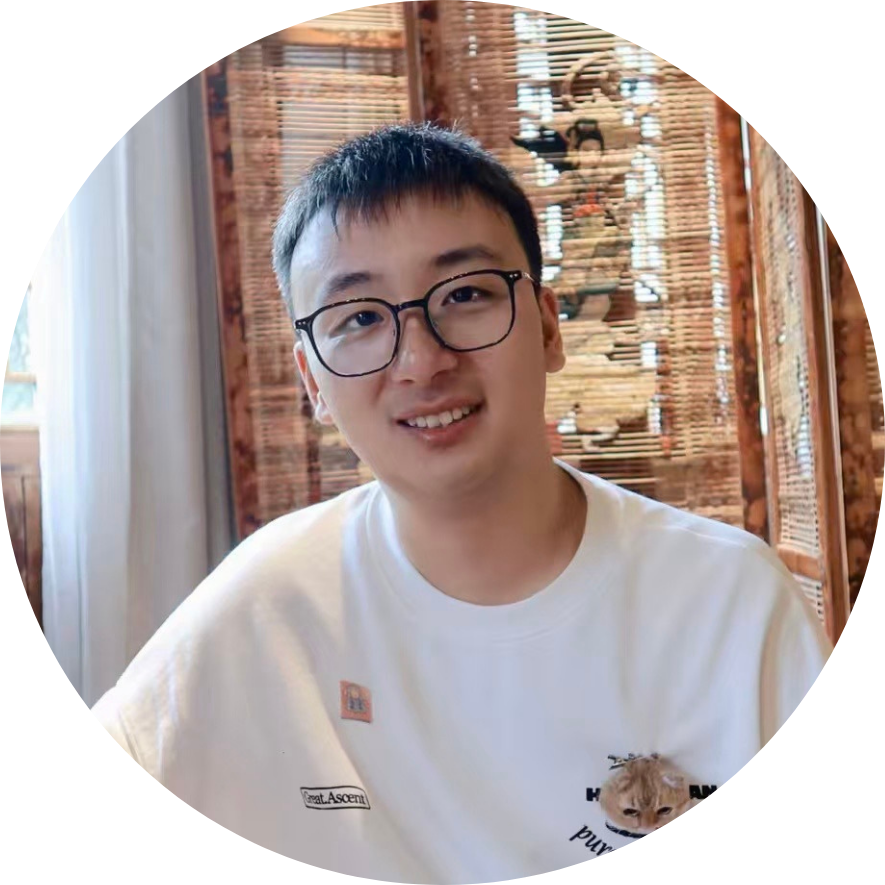

---
title: Organizing Committee
layout: default
description: Workshop's organizing committee
year: 2025
--- 

<svg width="1000" height="800">
<?xml version="1.0" encoding="utf-8"?>
<!-- Generator: Adobe Illustrator 23.1.1, SVG Export Plug-In . SVG Version: 6.00 Build 0)  -->
<svg version="1.1" id="Layer_1" xmlns="http://www.w3.org/2000/svg" xmlns:xlink="http://www.w3.org/1999/xlink" x="0px" y="0px"
     viewBox="0 0 875.1 692.8" style="enable-background:new 0 0 875.1 692.8;" xml:space="preserve">

<image style="overflow:visible;" width="1886" height="1018" xlink:href="images/committee/committee_25.png"  transform="matrix(0.5 0 0 0.5 -30 100)">
</image>
<a xlink:href="https://www.linkedin.com/in/ana%C3%AFs-artiges-phd-5b825baa/" >
    <text transform="matrix(1 0 0 1 100 150)" class="st1 st2" font-weight="bold">Anais Artiges </text>
    <text transform="matrix(1 0 0 1 145 150)" class="st1 st3" font-weight="bold">(she/her; co-chair)</text>
    <text transform="matrix(1 0 0 1 5 165)" class="st1 st2" font-weight="bold">New York University Grossman School of Medicine (USA)</text>
</a>
<a xlink:href="https://www.linkedin.com/in/guillermosahonero/" >
    <text transform="matrix(1 0 0 1 100 500)" class="st1 st2" font-weight="bold">Guillermo Sahonero </text>
    <text transform="matrix(1 0 0 1 200 500)" class="st1 st3" font-weight="bold">(he/him; co-chair)</text>
    <text transform="matrix(1 0 0 1 80 515)" class="st1 st2" font-weight="bold">Pontificia Universidad Católica de Chile (CHL)</text>
</a>
<a xlink:href="https://www.linkedin.com/in/jackline-thairu/" >
    <text transform="matrix(1 0 0 1 610 570)" class="st1 st2" font-weight="bold">Jackline Thairu </text>
    <text transform="matrix(1 0 0 1 700 570)" class="st1 st3" font-weight="bold">(she/her)</text>
    <text transform="matrix(1 0 0 1 600 585)" class="st1 st2" font-weight="bold">Sonar Imaging Center (KE)</text>
</a>
<a xlink:href="https://scholar.google.com/citations?hl=en&user=E39NQ7gAAAAJ" >
    <text transform="matrix(1 0 0 1 735 295)" class="st1 st2" font-weight="bold">Juan Pablo Meneses-Casanova </text>
    <text transform="matrix(1 0 0 1 780 295)" class="st1 st3" font-weight="bold">(he/him)</text>
    <text transform="matrix(1 0 0 1 675 310)" class="st1 st2" font-weight="bold">Monash University (AU)</text>
</a>
<a xlink:href="https://www.linkedin.com/in/evgenios-kornaropoulos-11814014/" >
    <text transform="matrix(1 0 0 1 280 450)" class="st1 st2" font-weight="bold">Evgenios Kornaropoulos </text>
    <text transform="matrix(1 0 0 1 410 450)" class="st1 st3" font-weight="bold">(he/him) </text>
    <text transform="matrix(1 0 0 1 300 465)" class="st1 st2" font-weight="bold">University of Liège (BE)</text>
</a>
<a xlink:href="https://www.linkedin.com/" >
    <text transform="matrix(1 0 0 1 600 295)" class="st1 st2" font-weight="bold">Zhiyi Chen </text>
    <text transform="matrix(1 0 0 1 695 295)" class="st1 st3" font-weight="bold">(he/him)</text>
    <text transform="matrix(1 0 0 1 590 310)" class="st1 st2" font-weight="bold">Third Military Medical University (CN)</text>
</a>

</svg>
</svg>

<table style="width:100%">
<tbody>
<tr>
    <td></td>
    <td><strong><a href="https://www.linkedin.com/in/ana%C3%AFs-artiges-phd-5b825baa/">Anais Artiges <a style="font-size: smaller;">(she/her)</a></a></strong>  New York University Grossman School of Medicine, USA</td>
</tr>
<tr>
<td></td>
<td><strong><a href="https://www.linkedin.com/in/guillermosahonero/">Guillermo Sahonero <a style="font-size: smaller;">(he/him)</a></a></strong>  Pontificia Universidad Católica de Chile, Chile</td>
</tr>
<tr>
    <td></td>
    <td><strong><a href="https://www.linkedin.com/in/jackline-thairu/">Jackline Thairu <a style="font-size: smaller;">(she/her)</a></a></strong>  Sonar Imaging Center, Kenya</td>
</tr>
<tr>
    <td></td>
    <td><strong><a href="https://scholar.google.com/citations?hl=en&user=E39NQ7gAAAAJ">Juan Pablo Meneses-Casanova <a style="font-size: smaller;">(he/him)</a></a></strong>  Monash University, Australia</td>
</tr>
<tr>
    <td></td>
    <td><strong><a href="https://www.linkedin.com/in/evgenios-kornaropoulos-11814014/">Evgenios Kornaropoulos <a style="font-size: smaller;">(he/him)</a></a></strong>  University of Liège, Belgium</td>
</tr>
<tr>
    <td></td>
    <td><strong><a href="https://www.linkedin.com/">Zhiyi Chen <a style="font-size: smaller;">(he/him)</a></a></strong>  Third Military Medical University, China/td>

</tr>
</tbody>
</table>

   
 The program committee greatly appreciates the guidance and assistance of the <a href="https://www.esmrmb.org/working-groups/">MRI Together Working Group of ESMRMB</a>.

