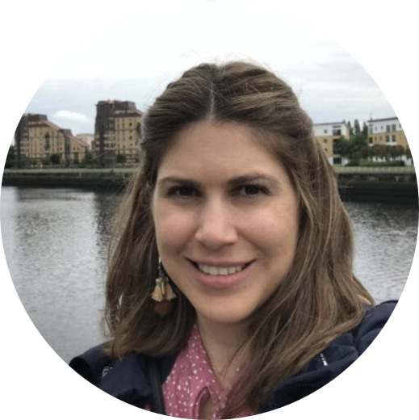
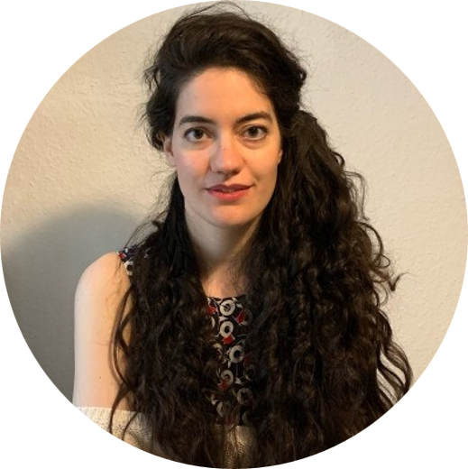
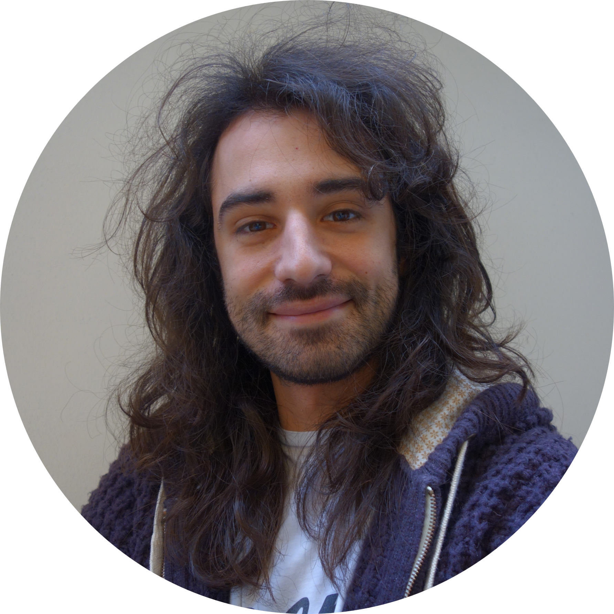
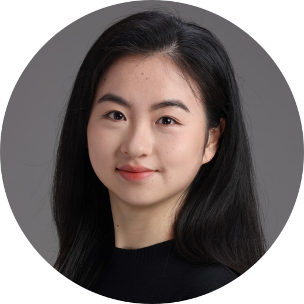
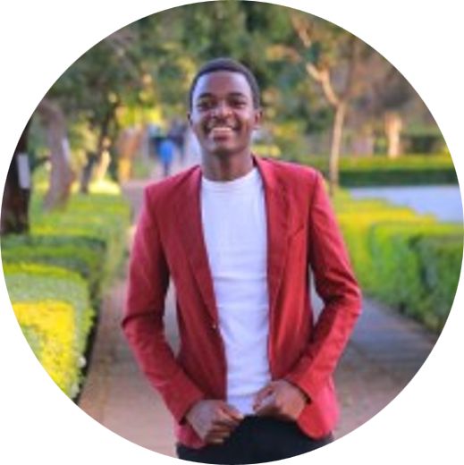
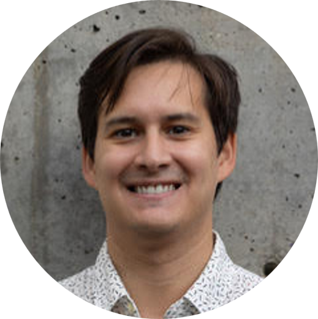
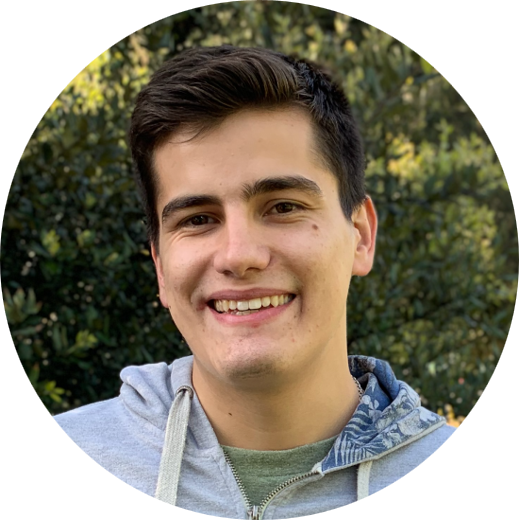

---
title: Organizing Committee
layout: default
description: Workshop's organizing committee
year: 2026
--- 

<svg width="1000" height="800">
<svg version="1.1" id="Layer_1" xmlns="http://www.w3.org/2000/svg" xmlns:xlink="http://www.w3.org/1999/xlink" x="0px" y="0px"
     viewBox="0 0 875.1 692.8" style="enable-background:new 0 0 875.1 692.8;" xml:space="preserve">

<!-- World map background (same asset as 2022 edition) -->
<image style="overflow:visible;" width="1886" height="1018" xlink:href="images/committee/worlddot.png"
       transform="matrix(0.3181 0 0 0.3181 111.494 251.5771)">
</image>

<!--
  Dot coordinates calibrated empirically from 2022 SVG ground-truth positions:
    x = 1.909 * lon + 381.5   (lon positive East)
    y = -2.273 * lat + 449.3  (lat positive North)

  Stanford CA  (37.4N, 122.2W) → (148, 364)
  Washington DC (38.9N,  77.0W) → (235, 361)
  Liège        (50.6N,   5.6E) → (392, 334)
  Basel        (47.6N,   7.6E) → (396, 341)
  Pisa         (43.7N,  10.4E) → (401, 350)
  Shanghai     (31.2N, 121.5E) → (613, 378)
  Nairobi      ( 1.3S,  36.8E) → (452, 452)
  Santiago CHL (33.5S,  70.6W) → (247, 525)
-->

<!-- Connecting lines (drawn first so dots render on top) -->
<path class="st4" d="M 40,200 Q 80,280 148,364"/>    <!-- Carlos → Stanford -->
<path class="st4" d="M 80,340 Q 160,350 235,361"/>   <!-- Maria → DC -->
<path class="st4" d="M 300,140 Q 340,235 392,334"/>  <!-- Jiqing → Liège -->
<path class="st4" d="M 435,140 Q 415,240 396,341"/>  <!-- Marta → Basel -->
<path class="st4" d="M 560,140 Q 495,240 401,350"/>  <!-- Matteo → Pisa -->
<path class="st4" d="M 750,155 Q 690,260 613,378"/>  <!-- Yueqi → Shanghai -->
<path class="st4" d="M 750,445 Q 600,450 452,452"/>  <!-- Cliff → Nairobi -->
<path class="st4" d="M 80,530 Q 160,528 247,525"/>   <!-- Javier → Santiago -->

<!-- Geographic dots -->
<circle cx="148" cy="364" r="4.5" class="st5"/>
<circle cx="235" cy="361" r="4.5" class="st5"/>
<circle cx="392" cy="334" r="4.5" class="st5"/>
<circle cx="396" cy="341" r="4.5" class="st5"/>
<circle cx="401" cy="350" r="4.5" class="st5"/>
<circle cx="613" cy="378" r="4.5" class="st5"/>
<circle cx="452" cy="452" r="4.5" class="st5"/>
<circle cx="247" cy="525" r="4.5" class="st5"/>

<!-- ===== HEADSHOTS & LABELS ===== -->

<!-- Carlos Castillo-Passi | Stanford, USA -->
<a xlink:href="https://www.linkedin.com/in/carlos-castillo-passi-468367146/">
<text transform="matrix(1 0 0 1 0 103)" class="st1 st3">Carlos Castillo-Passi (he/him)</text>
<text transform="matrix(1 0 0 1 0 116)" class="st1 st3">Stanford University (USA)</text>
<image xlink:href="images/committee/CarlosCastilloPassi.png" x="0" y="120" width="80" height="80"/>
</a>

<!-- Maria Mora | Children's National Hospital, Washington DC -->
<a xlink:href="https://www.linkedin.com/in/maria-mora-alvarez-phd/?locale=en">
<image xlink:href="images/committee/MariaMora.png" x="0" y="300" width="80" height="80"/>
<text transform="matrix(1 0 0 1 0 392)" class="st1 st3">Maria Mora (she/her)</text>
<text transform="matrix(1 0 0 1 0 405)" class="st1 st3">Children's Natl. Hospital (USA)</text>
</a>

<!-- Jiqing Huang | University of Liège -->
<a xlink:href="https://www.linkedin.com/in/jiqing-alain-huang-2a3279269/">
<text transform="matrix(1 0 0 1 255 43)" class="st1 st3">Jiqing Huang (he/him)</text>
<text transform="matrix(1 0 0 1 255 56)" class="st1 st3">Univ. de Liège (BE)</text>
<image xlink:href="images/committee/JiqingHuang.png" x="255" y="60" width="80" height="80"/>
</a>

<!-- Marta Brigid Maggioni | University of Basel (co-chair) -->
<a xlink:href="https://www.linkedin.com/in/marta-brigid-maggioni-56751727a/">
<text transform="matrix(1 0 0 1 397 43)" class="st1 st3">M. Maggioni (she/her; co-chair)</text>
<text transform="matrix(1 0 0 1 397 56)" class="st1 st3">Univ. of Basel (CH)</text>
<image xlink:href="images/committee/MartaBrigidMaggioni.png" x="400" y="60" width="80" height="80"/>
</a>

<!-- Matteo Cencini | IRCCS Stella Maris, Pisa -->
<a xlink:href="https://www.linkedin.com/in/matteo-cencini-b17482141/">
<text transform="matrix(1 0 0 1 540 43)" class="st1 st3">Matteo Cencini (he/him)</text>
<text transform="matrix(1 0 0 1 540 56)" class="st1 st3">IRCCS Stella Maris (IT)</text>
<image xlink:href="images/committee/MatteoCencini.png" x="540" y="60" width="80" height="80"/>
</a>

<!-- Yueqi Qiu | Shanghai Jiao Tong University (co-chair) -->
<a xlink:href="https://www.linkedin.com/in/yueqi-qiu-02608b307/">
<image xlink:href="images/committee/YueqiQiu.png" x="750" y="115" width="80" height="80"/>
<text transform="matrix(1 0 0 1 750 207)" class="st1 st3">Yueqi Qiu (she/her; co-chair)</text>
<text transform="matrix(1 0 0 1 750 220)" class="st1 st3">Shanghai JTU (CN)</text>
</a>

<!-- Cliff Mokua | Sonar Imaging Centre, Nairobi -->
<a xlink:href="https://www.linkedin.com/in/cliff-mokua-8810a7187/">
<image xlink:href="images/committee/CliffMokua.png" x="750" y="400" width="80" height="80"/>
<text transform="matrix(1 0 0 1 750 492)" class="st1 st3">Cliff Mokua (he/him)</text>
<text transform="matrix(1 0 0 1 750 505)" class="st1 st3">Sonar Imaging Ctr. (KE)</text>
</a>

<!-- Javier Bisbal | UC Chile, Santiago -->
<a xlink:href="https://www.linkedin.com/in/javier-bisbal-zenteno-b7380713b/">
<image xlink:href="images/committee/JavierBisbal.png" x="0" y="490" width="80" height="80"/>
<text transform="matrix(1 0 0 1 0 582)" class="st1 st3">Javier Bisbal (he/him)</text>
<text transform="matrix(1 0 0 1 0 595)" class="st1 st3">UC Chile (CHL)</text>
</a>

</svg>
</svg>

<table style="width:100%">
<tbody>
<tr>
    <td></td>
    <td><strong><a href="https://www.linkedin.com/in/maria-mora-alvarez-phd/?locale=en">Maria Mora <a style="font-size: smaller;">(she/her)</a></a></strong>  Children's National Hospital, Washington DC, USA</td>
</tr>
<tr>
    <td></td>
    <td><strong><a href="https://www.linkedin.com/in/marta-brigid-maggioni-56751727a/">Marta Brigid Maggioni <a style="font-size: smaller;">(she/her; co-chair)</a></a></strong>  University of Basel, Switzerland</td>
</tr>
<tr>
    <td></td>
    <td><strong><a href="https://www.linkedin.com/in/matteo-cencini-b17482141/">Matteo Cencini <a style="font-size: smaller;">(he/him)</a></a></strong>  IRCCS Stella Maris, Pisa, Italy</td>
</tr>
<tr>
    <td></td>
    <td><strong><a href="https://www.linkedin.com/in/yueqi-qiu-02608b307/">Yueqi Qiu <a style="font-size: smaller;">(she/her; co-chair)</a></a></strong>  Shanghai Jiao Tong University, Shanghai, China</td>
</tr>
<tr>
    <td></td>
    <td><strong><a href="https://www.linkedin.com/in/jiqing-alain-huang-2a3279269/">Jiqing Huang <a style="font-size: smaller;">(he/him)</a></a></strong>  University of Liège, Liège, Belgium</td>
</tr>
<tr>
    <td></td>
    <td><strong><a href="https://www.linkedin.com/in/cliff-mokua-8810a7187/">Cliff Mokua <a style="font-size: smaller;">(he/him)</a></a></strong>  Sonar Imaging Centre, Nairobi, Kenya</td>
</tr>
<tr>
    <td></td>
    <td><strong><a href="https://www.linkedin.com/in/carlos-castillo-passi-468367146/">Carlos Castillo-Passi <a style="font-size: smaller;">(he/him)</a></a></strong>  Stanford University, USA</td>
</tr>
<tr>
    <td></td>
    <td><strong><a href="https://www.linkedin.com/in/javier-bisbal-zenteno-b7380713b/">Javier Bisbal <a style="font-size: smaller;">(he/him)</a></a></strong>  UC Chile, Santiago, Chile</td>
</tr>
</tbody>
</table>

   
 The program committee greatly appreciates the guidance and assistance of the <a href="https://www.esmrmb.org/working-groups/">MRI Together Working Group of ESMRMB</a>.

