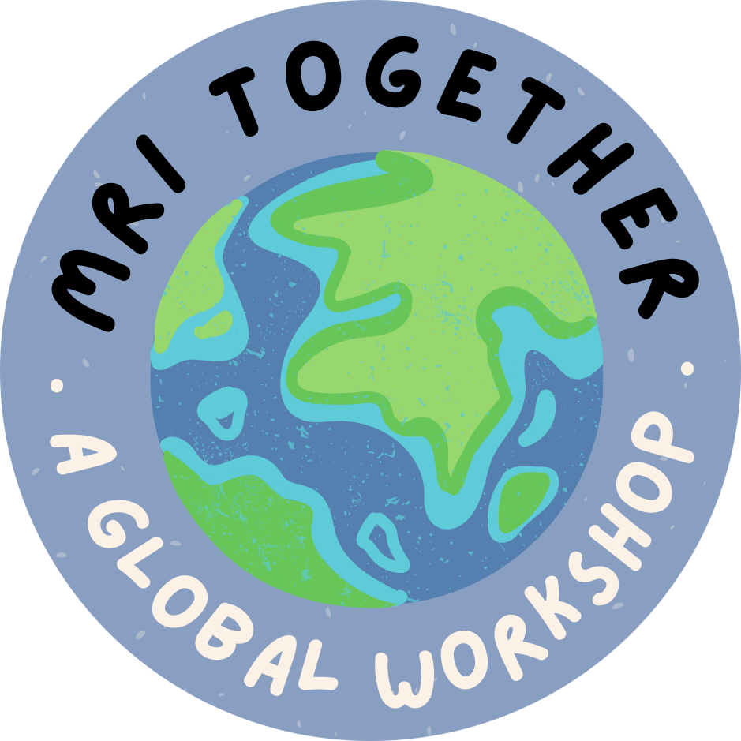

{: style="float: right; margin-left: 2em; width: 40%; height: 40%"}

## What?

[**#MRITogether**](https://twitter.com/hashtag/MRITogether) is a global online event on open, reproducible, and inclusive MRI research.

In 2026, MRI Together is becoming a **hackathon**: the **MRI TogetherThon**. The goal is to bring the community together around a shared, practical challenge — building a fully open-source, end-to-end MRI pipeline that benefits the entire field.

Whether you are an acquisition specialist, a reconstruction wizard, a software developer, or a clinical researcher, there is a role for you. The hackathon will be structured into focused sub-projects that span the full pipeline — from sequence design to final analysis — using open-source tools already trusted by the community.

 

## When?
The hackathon will be held **November 30 – December 4, 2026 (UTC)**. Sessions will span all time zones, and all contributions will be documented and openly shared.

## Who?
We are a [team](committee) of MRI scientists from different corners of the MRI world with a passion for open, reproducible, and inclusive science.
With support and endorsement from [ESMRMB](https://esmrmb.org/), this event aims to produce something the community can use, build on, and publish.

Whether you're a **sequence developer**, **reconstruction engineer**, **image analysis expert**, **software developer**, or **clinical researcher**, there is a project for you here.
