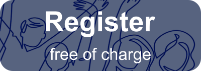

--- 
title: Registration
layout: default
--- 
<!-- [{:.inline_img}](https://events.zoom.us/ev/AEaNvEVYuDSSPf8Chveqs5EvDC-eWPCQxNQF-_QhyU_OAr-5Z4iywooXKyHd6k245Kd-eJM)
{: style="text-align: center;"}

**For technical reasons, supporter registration is now closed. But you can still register for free! If you want to support MRI Together and other similar initiatives, please consider [becoming an ESMRMB member](https://www.esmrmb.org/membership/#m-application)!**
 -->
In order to promote inclusivity and encourage reproducibility within our field, we feel strongly that participation should be accessible to all. We are therefore offering the option to register for the workshop free of charge (_registration will open soon_). However, in order to host this workshop, we have minimum costs we need to cover. If you’d like to support this workshop and future similar endeavors, please consider registering as a supporting attendee (_registration will open soon_) or **[becoming an ESMRMB member](https://www.esmrmb.org/membership/#m-application)**.

We encourage senior, funded researchers and professors to register as supporting attendees, providing a donation such that students and fellow researchers with restricted fundings are able to enjoy the meeting free of charge. As a thank you for your contribution, we will keep a list of our supporting attendees here (which you can opt out from, if you wish to remain anonymous).

<!-- **Note:** the conference will be held through the [Zoom Events](https://events.zoom.us/) platform. A Zoom account (available free of charge) is required at registration. -->

### Want to help out in other ways?

We'll need volunteers to help us with technical aspects, the social gathering platform, and video editing captioning and uploading, and communications and social media management, and we'd love to have you on board!

Fill in **[this form](https://forms.gle/fVFNEWNVmfvGutUH9)** to indicate your availability!